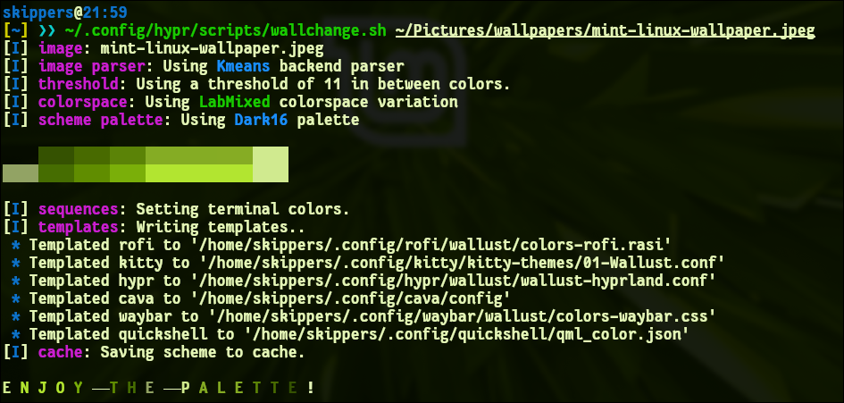

# Hyprland Dynamic Terminal Colors
## Preview

Automatically change terminal colors based on wallpaper using:

- Hyprland
- swww
- wallust
- kitty
- zsh + fishbone++

---

# Features

- Dynamic terminal colors
- Wallpaper-based palette generation
- Automatic kitty reload
- Hyprland compatible
- Easy setup

---

# Dependencies

## Install cargo

```bash
sudo apt install cargo
```

---

## Install swww

```bash
sudo apt install swww
```

If package is unavailable:

```bash
git clone https://github.com/LGFae/swww
cd swww
cargo build --release
sudo cp target/release/swww /usr/local/bin/
```

---

## Install wallust

```bash
cargo install wallust
```

Add cargo path:

```bash
echo 'export PATH="$HOME/.cargo/bin:$PATH"' >> ~/.zshrc
source ~/.zshrc
```

---

# Kitty Setup

Edit kitty config:

```bash
nano ~/.config/kitty/kitty.conf
```

Add:

```conf
allow_remote_control yes
include ~/.config/kitty/kitty-themes/01-Wallust.conf
```

---

# Install Script

Clone repo:

```bash
git clone https://github.com/Gna68/hyprland-dynamic-colors.git
cd hyprland-dynamic-colors
```

Copy files:

```bash
mkdir -p ~/.config/hypr/scripts

cp scripts/wallchange.sh ~/.config/hypr/scripts/
chmod +x ~/.config/hypr/scripts/wallchange.sh
```

---

# Hyprland Setup

Edit:

```bash
nano ~/.config/hypr/hyprland.conf
```

Add:

```ini
exec-once = swww-daemon
```

---

# Usage

```bash
~/.config/hypr/scripts/wallchange.sh ~/Pictures/wallpapers/wallpaper.jpg
```

Result:
- Wallpaper changes
- Wallust generates palette
- Kitty colors reload automatically

---

# Troubleshooting

## wallust command not found

```bash
export PATH="$HOME/.cargo/bin:$PATH"
```

---

## permission denied

```bash
chmod +x ~/.config/hypr/scripts/wallchange.sh
```

---

# Notes

This setup changes:
- terminal palette
- ANSI colors
- kitty theme

Fishbone++ prompt colors are still static unless manually themed..
